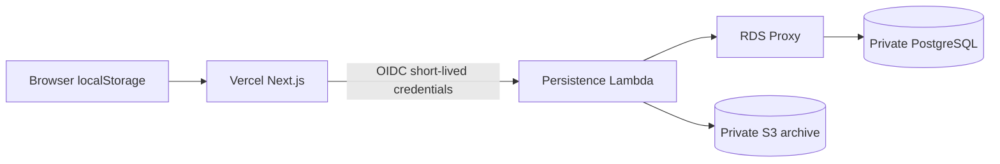

# Alexander durable persistence

Alexander stores onboarding in two places:

- PostgreSQL is the durable system of record for drafts and every successful submission.
- S3 is the immutable archive of a submission. It is not the draft database.

The browser keeps a localStorage copy so editing can continue when the server cannot be reached. Redis is an optional cache. Production correctness does not depend on it.



## Region

Everything in this stack is in the AWS account and region used at deploy time. The intended region is `us-east-1`, the same region as the existing AWS session. Do not place RDS, the proxy, S3, KMS, or Lambda in different regions.

## What the stack creates

| Piece | Role |
| --- | --- |
| VPC `10.42.0.0/16` | Isolated subnets only. No NAT gateway and no path from the internet to PostgreSQL. |
| RDS PostgreSQL 16 | `db.t4g.micro`, single-AZ, 20 GiB gp3, encrypted, not publicly accessible, 7-day backups, deletion protection. |
| RDS Proxy | TLS required. The persistence Lambda is the only application client. |
| Secrets Manager | Master secret for bootstrap. Separate `alexander_app` secret for the Lambda. |
| S3 | Private submission archive. Block Public Access, bucket-owner enforced, versioning, HTTPS-only, SSE-KMS. |
| KMS | One customer-managed key for RDS storage and the S3 archive. Database secrets use the AWS-managed Secrets Manager key so they stay encrypted without a CloudFormation dependency cycle. |
| Persistence Lambda | `getDraft`, `upsertDraft`, `submitDraft`, `health`, plus admin `schemaStatus` and `inspectSession`. |
| Migration Lambda | Applies `infra/sql/001_onboarding_storage.sql` and creates `alexander_app`. It does not drop tables. |
| Vercel IAM role | `lambda:InvokeFunction` on the persistence Lambda only, trusted only for production of project `alexander`. |

## Cost choice

This is a small single-AZ MVP. Multi-AZ would about double the database price and is not enabled. There is no NAT gateway. Interface VPC endpoints for Secrets Manager, KMS, and CloudWatch Logs are in one Availability Zone so the Lambda can reach AWS APIs without the internet. RDS Proxy is included because Lambda talks to PostgreSQL only through the proxy.

Approximate on-demand list prices in `us-east-1`, excluding tax and data transfer:

- `db.t4g.micro` single-AZ: about $12–15 per month
- 20 GiB gp3: about $2–3 per month
- RDS Proxy for a 2 vCPU instance: about $22 per month
- three interface endpoints in one AZ: about $22 per month
- KMS key and two secrets: about $2 per month

Confirm current prices in the AWS pricing calculator before treating these as a bill.

## Environment variables

Set these on the existing Vercel project, production only. They are identifiers, not secrets.

- `AWS_REGION`
- `AWS_ROLE_ARN`
- `ALEXANDER_PERSISTENCE_LAMBDA_ARN`

Do not set `AWS_ACCESS_KEY_ID`, `AWS_SECRET_ACCESS_KEY`, or a database password in Vercel. The Next.js server assumes `AWS_ROLE_ARN` with the Vercel OIDC token and invokes the Lambda. The Lambda reads the database secret inside AWS.

`ALLOW_LOCAL_ONLY_PERSISTENCE=true` is for local development and tests only. Production ignores it.

`REDIS_URL` may stay unset. If Redis is present and PostgreSQL has no newer draft, the server can import that Redis draft once. It never overwrites a newer PostgreSQL draft, and it never deletes Redis keys.

## Drafts

`PUT /api/onboarding/draft` validates the current envelope and upserts `onboarding_sessions`. Autosave does not write to S3. An older `updatedAt` cannot replace a newer row.

The browser still writes localStorage first. The status line says “Saved” only after that local write and a successful durable server write. If the server write fails, it says “Not saved to server yet”. If durable storage is not configured, it says “Saved in this browser”.

## Submissions

`POST /api/onboarding/submit` still migrates the posted draft, validates sections 1–8 and Q114, computes the content revision, and calls `normalizeOnboardingDraft()` in the Next.js server. The Lambda stores that payload. It does not invent business policy.

A successful response is returned only after the database transaction commits. The order is:

1. Write `raw-draft.json`.
2. Write `normalized-config.json`.
3. Write `manifest.json` last.
4. Insert the submission row and update the session in one transaction.

S3 keys are:

```text
onboarding/<sessionId>/submissions/<sha256(contentRevision)>/raw-draft.json
onboarding/<sessionId>/submissions/<sha256(contentRevision)>/normalized-config.json
onboarding/<sessionId>/submissions/<sha256(contentRevision)>/manifest.json
```

The content revision is the questionnaire fingerprint, so it can contain answer text. The object key uses a SHA-256 of that fingerprint. Keys do not include company name, phone, customer name, or email.

The same session and content revision writes the same keys and the same submission row. A changed questionnaire creates a new revision and leaves the previous row and objects in place. If S3 succeeds and the database commit fails, the client gets an error. A retry uses the same keys and the same revision, then commits the database row. No second logical submission is created.

## Schema versions

`OnboardingDraft.schemaVersion` is the questionnaire model. It stays at 10 unless that model changes.

`schema_migrations.version` is the database migration. The first migration is `001`.

## Local development

Without AWS variables, set `ALLOW_LOCAL_ONLY_PERSISTENCE=true` outside production. Drafts then live in process memory plus browser localStorage. That store is not durable and is not used in production.

## Health

`GET /api/onboarding/health` reports only:

```json
{ "durablePersistence": true, "database": "ok", "snapshotStorage": "ok" }
```

It does not return hostnames, usernames, bucket internals, or secret ARNs.

## Logging

Logs may include the operation, status, duration, a hash prefix of the session id, and a hash prefix of the revision. They must not include the questionnaire, contact details, or credentials.

## Failure behavior

- Lambda or database unavailable: draft autosave stays in the browser and shows that the server copy is not saved. Submit does not open the confirmation page.
- S3 write fails: submit returns an error and does not commit the database row.
- Database commit fails after S3: submit returns an error. Retry is idempotent.
- Production without the Lambda configured: submit is rejected. It does not fall back to memory or Redis.
